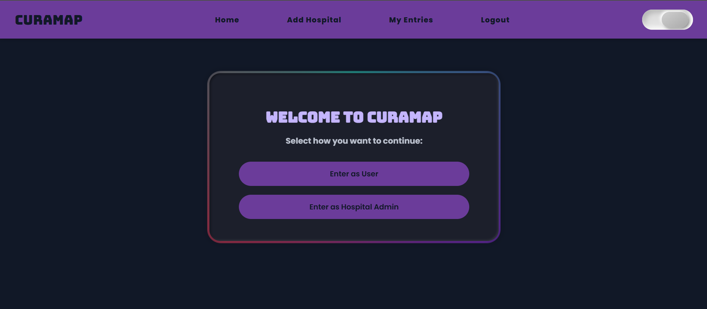
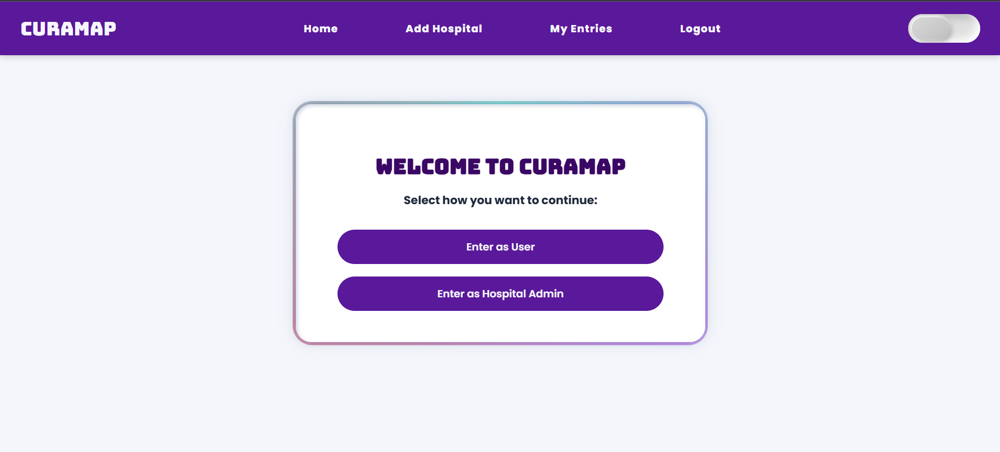
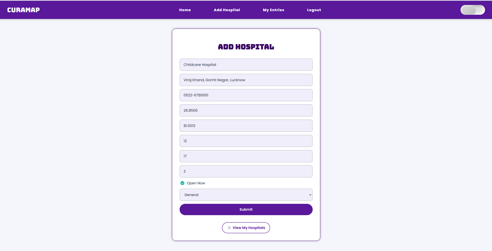
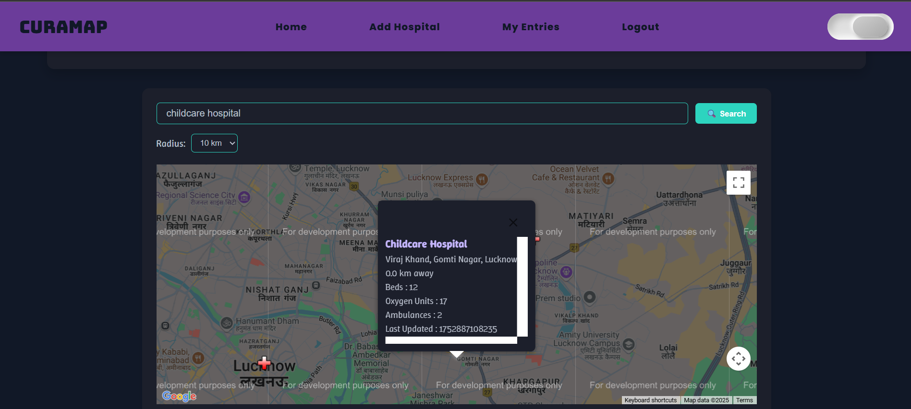
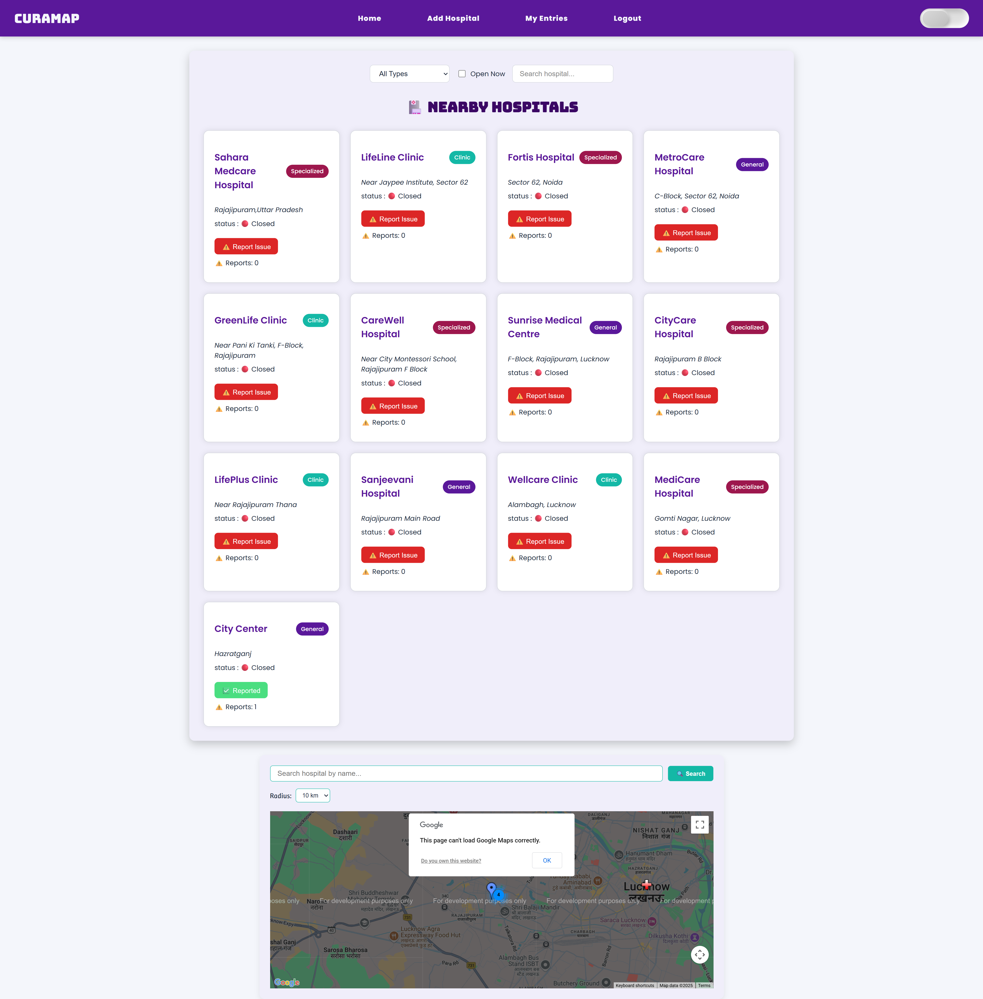

# CuraMap 🏥🗺️

**CuraMap** is your go-to full-stack app for finding hospitals and healthcare facilities with live updates on essential resources like beds, oxygen, and ambulances — all mapped out for easy access!

🌐 [Live Demo → cura-map.vercel.app](https://cura-map.vercel.app)

---

## 🚀 Features

- 🔍 **Search & Filter Hospitals** by name, location, and available resources
- 🗺️ **Interactive Google Maps** with clickable hospital markers
- 🏥 **Hospital Entry Management** — Add, update, or delete your hospital info securely
- 🔐 **User Authentication** with email/password & Google OAuth using JWT
- 📊 **Live Resource Availability** for beds, oxygen, ambulances _(currently using dummy data)_
- 🛡️ **Protected Routes** to keep hospital data safe and accurate
- ⚙️ **Robust Backend API** with Express.js & MongoDB Atlas

---

## 🛠️ Tech Stack

- **Frontend:** React.js + React Router + CSS
- **Backend:** Node.js + Express.js
- **Database:** MongoDB Atlas with Mongoose
- **Authentication:** JWT + Passport.js (Google OAuth)
- **Maps:** Google Maps JavaScript API

---

## 💡 How It Works

1. **Find hospitals** near you or by name — with real-time data on available beds, oxygen, and ambulances.
2. View hospitals **on the map** with detailed info in clickable markers.
3. **Hospital admins** can securely log in to manage their entries (add/update/delete).
4. All data syncs via a secure **backend API** with JWT-based route protection.

---

## 📸 Screenshots

Here are a few highlights from CuraMap.  
See the rest in the [`screenshots/`](./Screenshots) folder.

### 🏠 Landing Page - Dark Theme


### 🏠 Landing Page - Light Theme


### ➕ Add Hospital


### 📍 Hospital Map View


### 🔍 View Hospitals


---

## 🧪 How to Run CuraMap Locally

### 1. **Clone the repo**

```bash
git clone https://github.com/Gaurangi25/CuraMap.git
cd CuraMap
```

### 2. **Install Dependencies**

Backend ->
cd server
npm install

Frontend ->
cd ../client
npm install

### 3. **Set Up Environment Variables**
Create .env in /server:
MONGO_URI=your_mongodb_connection_string
JWT_SECRET=your_jwt_secret_key
GOOGLE_CLIENT_ID=your_google_oauth_client_id
GOOGLE_CLIENT_SECRET=your_google_client_secret
CLIENT_URL=http://localhost:3000
SERVER_URL=http://localhost:5000
SESSION_SECRET=some_random_long_string_here

Create .env.local in /client:

REACT_APP_GOOGLE_MAPS_API_KEY=your_google_maps_api_key
REACT_APP_GOOGLE_CLIENT_ID=your_google_client_id
REACT_APP_API_BASE_URL=http://localhost:5000

### 4. **Start the backend**
cd ../server
nodemon server.js

### 5. **Start the frontend**
cd ../client
npm start

### 6. **Open the app in browser**
Go to: http://localhost:3000


